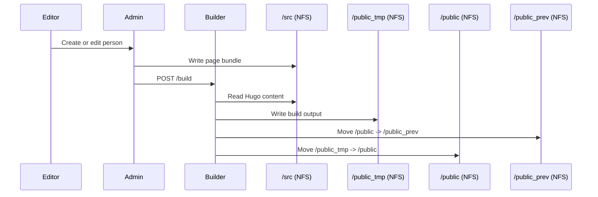

# Data Flow

## Summary
Editors work in the admin UI, which writes Hugo page bundles under `/src/content/family/**/index.md`. The builder reads `/src`, generates a full site into `/public_tmp`, and then atomically swaps the new build into `/public`.

## Flow Diagram

## Atomic Swap Details
The swap process ensures the public site is either the last complete build or the new complete build:
1. Build to `/public_tmp`.
2. Move `/public` to `/public_prev`.
3. Move `/public_tmp` to `/public`.

If the build fails, `/public` is not modified.
